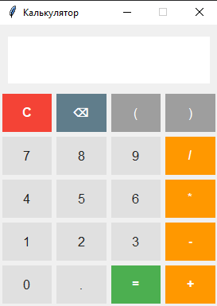
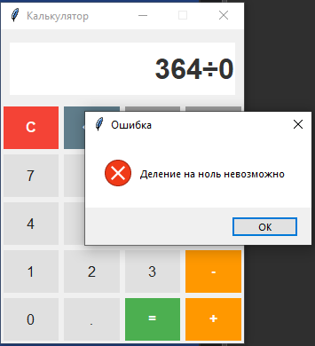

# Калькулятор для обучения QA

Проект содержит две версии программы калькулятора:
1. **Стабильная версия** - корректно работающий калькулятор
2. **Bug-версия** - специальная версия с багами для тренировки навыков тестирования

## Особенности версий

### Стабильная версия
- Полностью протестированный функционал
- Защита от некорректного ввода:
  - Проверка математических выражений
  - Предотвращение множественных точек в числах
  - Блокировка недопустимых символов
- Обработка ошибок:
  - Деление на ноль
  - Синтаксические ошибки
  - Некорректные последовательности операторов
- Безопасный `eval` с ограничениями

### Bug-версия
Специально содержит следующие проблемы:
- **Уязвимости безопасности**:
  - **Небезопастное использование `eval()`**  
    - Возможность выполнения произвольного кода из строки ввода
- **Функциональные баги**:
  - Множественные точки в числах (5.5.5)
  - Некорректная обработка нескольких операторов (5+++--3)
  - Ошибочная обработка деления на ноль
- **Логические ошибки**:
  - Неправильная обработка процентов
  - Автозамена операторов (^ → *)
  - Некорректная обработка скобок
- **UI-проблемы**:
  - Отображение "0" вместо ошибок
  - Некорректные сообщения об ошибках

## Установка и запуск
1. Клонируйте репозиторий
2. Установите зависимости tkinter
3. Запустите нужную версию

## ЛИБО

1. Скачайте .exe нужной версии
2. Запустите нужный .exe

### Скриншоты интерфейса

## Дисклеймер 

**Этот проект создан исключительно в образовательных целях:**

1. Уязвимости в Bug-версии **преднамеренны** и служат для:
   - Демонстрации распространённых ошибок безопасности
   - Обучения методам тестирования
   - Обучение писать чек-листы, тест-кейсы и etc.
   - Практики поиска уязвимостей в контролируемой среде

**Если были обнаружены баги, неописанные в этом Readme, даже в стабильной версии - так и должно быть**
